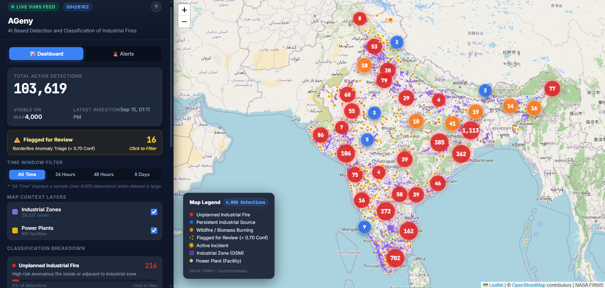
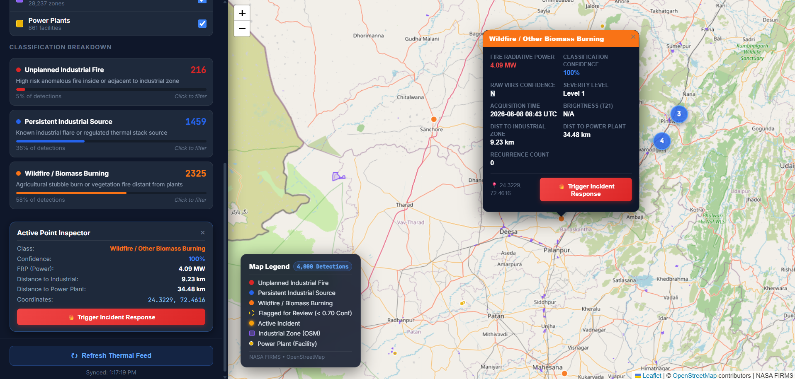
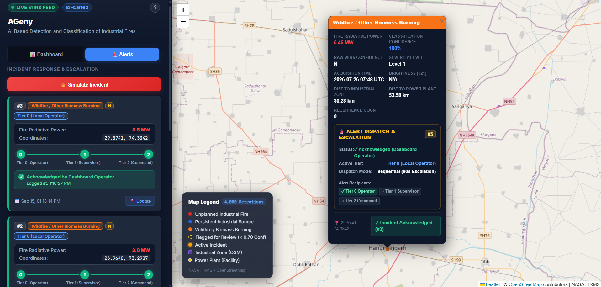
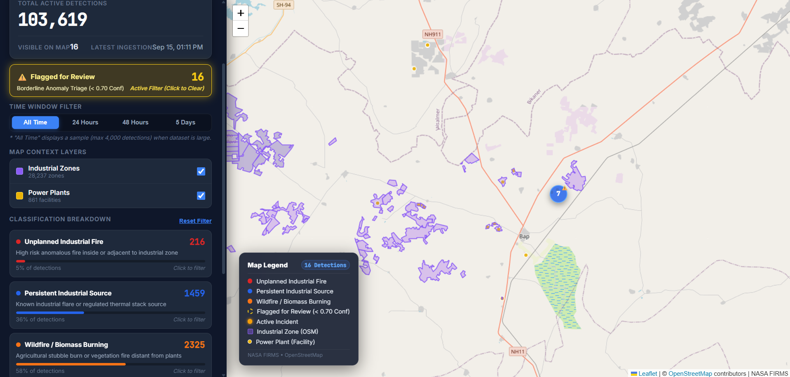

# AI-Based Detection & Classification of Industrial Fires & Flares (SIH 26162)

<div style="display: flex; justify-content: space-around; align-items: center; flex-wrap: wrap; gap: 10px;">
  <a href="https://sih-26162-ai-based-detection-and-cl.vercel.app/"></a>
  <a href="https://sih26162-ai-based-detection-and.onrender.com/docs"></a>
  <a href="https://supabase.com"></a>
</div>

An end-to-end, near-real-time satellite thermal monitoring, machine learning classification, and automated emergency escalation platform for industrial fire safety across India. The system ingests thermal hotspot data from NASA FIRMS (VIIRS_SNPP), filters detections against sovereign Indian borders, enriches each detection with high-performance PostGIS spatial geospatial features (proximity to industrial zones and power plants, plus spatial DBSCAN recurrence), classifies thermal signatures via a Random Forest model into **persistent industrial flares**, **unplanned industrial fires**, or **wildfires/biomass burning**, and visualizes them on an interactive React + Leaflet intelligence dashboard while driving a multi-tier automated incident response engine.

---

## ⚡ How It Works

- **Satellite Ingestion & Sovereign Boundary Filtering**: Continuously ingests Near-Real-Time (NRT) thermal radiation data for India from the NASA FIRMS VIIRS 375m sensor via `fetch_firms.py`. Detections are filtered directly against a real sovereign India boundary polygon (`india_boundary` table, sourced from DataMeet's composite India boundary) using PostGIS `ST_Within`, ensuring only points genuinely within India's borders are retained and excluding cross-border or oceanic noise.
- **Spatial Feature Engine**: Enriches thermal detections in PostgreSQL/PostGIS by computing KNN distances to 28,000+ industrial zones and 800+ power plants, plus spatio-temporal DBSCAN cluster recurrence (`ST_ClusterDBSCAN`).
- **ML Classification & High-Performance Write-Back**: A Random Forest classifier categorizes detections into *Persistent Industrial Sources (Flares)*, *Unplanned Industrial Fires*, or *Wildfires / Biomass Burning*. `train_classifier.py` writes predictions, calibrated confidence scores, and triage flags back to the database in a single batched `UPDATE` query via `psycopg2.extras.execute_values`, processing 100,000+ rows in seconds.
- **Human-in-the-Loop Triage**: Probabilistic confidence scoring flags ambiguous boundary detections (`confidence_score < 0.70`) with a `needs_review` indicator for manual safety verification.
- **Incident Response & Escalation**: An automated 3-tier escalation engine dispatches real email alerts via Gmail SMTP, supporting VIIRS-confidence-based dispatch (sequential vs. parallel) and one-click email acknowledgment.
- **Interactive Web Dashboard**: Serves GeoJSON layers, live clustering, temporal playback, risk analytics, and simulation triggers via FastAPI to a React & Leaflet frontend.

---

## 🔗 Live Demo

- **Interactive Dashboard (Frontend)**: [https://sih-26162-ai-based-detection-and-cl.vercel.app/](https://sih-26162-ai-based-detection-and-cl.vercel.app/)
- **REST API & Swagger Docs (Backend)**: [https://sih26162-ai-based-detection-and.onrender.com/docs](https://sih26162-ai-based-detection-and.onrender.com/docs)

> [!NOTE]
> The hosted cloud demo represents the core satellite monitoring and ML classification dashboard. The Emergency Alert & Incident Response System (email escalation & click-to-acknowledge) is currently configured for local demonstration and testing.

---

## 🏗️ Architecture Overview

```
 +-------------------------------------------------------------------------+
 |                          NASA FIRMS API                                 |
 |               (VIIRS_SNPP 375m NRT Thermal Radiation Data)              |
 +------------------------------------+------------------------------------+
                                      |
                                      v
 +-------------------------------------------------------------------------+
 |         Supabase Managed Database Engine (PostgreSQL + PostGIS)         |
 |   - Sovereign India Boundary Filtered Hotspots (via ST_Within on        |
 |     india_boundary polygon sourced from DataMeet)                       |
 |   - Industrial Zone Polygons (OSM) & Thermal/Renewable Plants (WRI)     |
 +------------------------------------+------------------------------------+
                                      |
                                      v
 +-------------------------------------------------------------------------+
 |                      Spatial Feature Engineering                        |
 |   - PostGIS KNN ST_Distance (nearest industrial zone & power plant)     |
 |   - Spatio-temporal ST_ClusterDBSCAN recurrence count (eps=0.0045)      |
 +------------------------------------+------------------------------------+
                                      |
                                      v
 +-------------------------------------------------------------------------+
 |                     Random Forest ML Classifier                         |
 |   - Predicts: Persistent Industrial Source | Unplanned Industrial Fire  |
 |               | Wildfire / Other Biomass Burning                       |
 |   - Outputs: Calibrated Confidence Score & `needs_review` Flag (< 0.70) |
 |   - High-performance batched UPDATE via psycopg2 execute_values         |
 +------------------------------------+------------------------------------+
                                      |
                                      v
 +-------------------------------------------------------------------------+
 |                   FastAPI Backend Service (on Render)                   |
 |   - High-performance GeoJSON stream endpoints & filtering APIs          |
 |   - Summary statistics, recurrence metrics, and fire risk aggregates    |
 |   - Incident Response & Escalation Handler                              |
 +------------------+------------------------------------+-----------------+
                    |                                    |
                    v                                    v
 +------------------------------------+  +---------------------------------+
 | React + Leaflet Dashboard (Vercel) |  | Incident Response Engine        |
 | - Interactive heatmaps & clusters  |  | - 3-Tier Escalation Management  |
 | - Anomaly inspect panel            |  | - VIIRS Confidence Dispatch     |
 | - Manual & Simulation Triggers     |  | - Gmail SMTP Dispatch & Acknowl.|
 +------------------------------------+  +---------------------------------+
```

---

## 🚨 Emergency Alert & Incident Response System

To bridge the gap between thermal anomaly detection and immediate operational action, the platform features an automated **Incident Response & Escalation Engine**:

### 1. 3-Tier Escalation Workflow
When an unplanned industrial fire or high-risk thermal anomaly is triggered, alerts are dispatched across three organizational tiers:
- **Tier 0 (On-Duty / Site Team)**: Immediate notification to local plant safety supervisors and on-site responders.
- **Tier 1 (Fire Safety Officers / Incident Commanders)**: Escalated alerting to regional safety managers and fire officers if unacknowledged.
- **Tier 2 (Senior Management / Central Command)**: High-level notification to disaster management executives and safety directors.

Alerts are formatted as rich HTML/text notifications and dispatched in real time via **Gmail SMTP**.

### 2. VIIRS-Confidence-Based Dispatch Modes
The dispatch cadence adapts dynamically based on NASA VIIRS detection confidence:
- **Sequential Escalation (Low / Nominal Confidence)**: Tier 0 is alerted immediately. If the incident remains unacknowledged after 60 seconds, it automatically escalates to Tier 1; after a further 60 seconds without acknowledgment, it escalates to Tier 2.
- **Parallel Dispatch (High Confidence)**: Critical, unambiguous high-confidence detections bypass the delay and dispatch notifications to **all 3 tiers simultaneously in parallel**, ensuring zero latency during severe emergencies.

### 3. Click-to-Acknowledge
Every alert email contains a secure, one-click acknowledgment link (routed via an **ngrok** tunnel during local demonstrations). When any recipient clicks the link:
- The incident status transitions immediately to `Acknowledged`.
- All pending escalation timers are automatically cancelled, preventing alarm fatigue and redundant notifications.
- No email reply parsing or external inbox monitoring is required.

### 4. Incident Triggering Mechanisms
- **Direct Map Trigger**: Operators can click on any active/flagged thermal hotspot on the Leaflet map and trigger an incident response directly via the popup inspection interface.
- **"Simulate Incident" Demo Mode**: A dedicated demo button selects a real thermal anomaly from the database and executes the complete end-to-end alert and escalation pipeline in real time.
- **Duplicate-Trigger Prevention**: Once a thermal point has an active incident, it is locked from re-triggering — the trigger button is replaced with an '✓ Incident Active (#ID)' badge. The point retains its original ML classification (it is never overwritten by incident state), and its inspector panel displays an ALERT DISPATCH & ESCALATION section showing the incident ID, current active tier, and which tier levels have received notifications.
- **Exclusion of Persistent Industrial Sources**: Flares and known, permitted industrial sources are **explicitly blocked** from triggering alerts (enforced both client-side in the UI and validated server-side), preventing false alarms for normal, regulated operations.

> [!NOTE]
> **Hackathon Scope Note**: The current implementation demonstrates emergency alerting using team member emails over Gmail SMTP. Real-world deployments would interface directly with national emergency dispatch frameworks (e.g., ERSS-112, NDRF, SDMA, and industrial SCADA/CAP systems). This design was an intentional, safe proof-of-concept for hackathon demonstration.

---

## 🛠️ Tech Stack Summary

| Layer | Technology | Purpose |
|---|---|---|
| **Data Ingestion** | Python 3, NASA FIRMS REST API | Automated fetching of satellite thermal radiation anomalies |
| **Spatial Database** | PostgreSQL 15/16, PostGIS 3.4 (Supabase / Docker) | Vector spatial indexing (GIST), KNN distance queries, boundary filtering (`ST_Within`), DBSCAN clustering (`ST_ClusterDBSCAN`) |
| **Feature & ML Pipeline** | scikit-learn, pandas, joblib, matplotlib, psycopg2 | Random Forest classification, temporal evaluation, confidence gating, batched database write-backs (`execute_values`) |
| **Backend & Alerting** | FastAPI, Uvicorn, psycopg2, smtplib, ngrok | Async REST API, GeoJSON serialization, 3-tier SMTP email alerting, public tunnel for email acknowledgment |
| **Frontend UI** | React 19, Leaflet, React-Leaflet, MarkerCluster | High-performance interactive map visualization, telemetry analytics, incident simulation controls |
| **Containerization** | Docker, Docker Compose | Reproducible local spatial database environment with pre-seeded data |
| **Cloud Hosting** | Vercel (Frontend), Render (FastAPI Web Service & Scheduled Cron), Supabase (PostgreSQL + PostGIS Database) | Scalable production hosting with decoupled compute and database tiers |

---

## 🚀 Cloud Deployment

The production environment is deployed across modern cloud platforms:

- **Frontend (Vercel)**: Hosted at [sih-26162-ai-based-detection-and-cl.vercel.app](https://sih-26162-ai-based-detection-and-cl.vercel.app/) — continuously built and deployed from the `frontend/` directory on every push to `main`.
- **Backend API (Render)**: Hosted at [sih26162-ai-based-detection-and.onrender.com](https://sih26162-ai-based-detection-and.onrender.com) — FastAPI web service connected to the Supabase database instance, providing automated OpenAPI documentation at `/docs`.
- **Database (Supabase PostgreSQL + PostGIS)**: Cloud-managed PostgreSQL instance with PostGIS extension enabled on Supabase, pre-seeded with 100,000+ thermal records, nationwide industrial zones, power plant infrastructure, and sovereign India boundary polygons.
- **Automated Data Sync (Render Cron Job)**: Scheduled runner executing `fetch_firms.py` (ingestion only) **every 6 hours** to fetch fresh NASA FIRMS detections, filter them against India's boundary, and ingest them into the live Supabase database.

---

## 💻 Quick Start / Local Setup

Follow these steps to run the complete stack locally:

### 1. Clone the Repository
```bash
git clone https://github.com/kumarketanbansal-hue/SIH26162-AI-Based-Detection-and-Classification-of-Industrial-Fires.git
cd SIH26162-AI-Based-Detection-and-Classification-of-Industrial-Fires
```

### 2. Configure Environment Variables
Copy `.env.example` to `.env` and configure your credentials:
```bash
cp .env.example .env
```
In `.env`, provide values for `FIRMS_MAP_KEY` and `DB_PASSWORD` (and the alert credentials below if testing the Incident Response system):
```env
# Core database & ingestion (Local Docker or Supabase)
FIRMS_MAP_KEY=your_nasa_firms_map_key_here
DB_HOST=localhost
DB_PORT=5432
DB_NAME=sih_fire_db
DB_USER=postgres
DB_PASSWORD=your_postgres_password_here
DB_SSLMODE=prefer
BBOX=68.1,6.7,97.4,35.5

# Emergency Alert System (optional — required only for Incident Response testing)
ALERT_EMAIL_ADDRESS=your_gmail_address@gmail.com
ALERT_EMAIL_APP_PASSWORD=your_gmail_app_password

TIER_0_EMAIL=tier0_responder@example.com
TIER_0_NAME=Tier 0 Responder Name

TIER_1_EMAIL=tier1_responder@example.com
TIER_1_NAME=Tier 1 Responder Name

TIER_2_EMAIL=tier2_responder@example.com
TIER_2_NAME=Tier 2 Responder Name

# Public URL for one-click email acknowledgment links (use your ngrok tunnel URL locally)
PUBLIC_BASE_URL=https://your-ngrok-subdomain.ngrok-free.dev
```
> [!TIP]
> You can generate a free NASA FIRMS API key at [NASA FIRMS API Key Portal](https://firms.modaps.eosdis.nasa.gov/api/map_key/). For `ALERT_EMAIL_APP_PASSWORD`, use a Gmail [App Password](https://myaccount.google.com/apppasswords), not your regular account password.

### 3. Start Database Container
Launch the PostGIS database container using Docker Compose:
```bash
docker-compose up -d
```
> [!NOTE]
> `seed_data.sql` automatically pre-loads **100,000+ processed thermal detection points**, 28,000+ industrial zones, 800+ power plant locations, and the sovereign India boundary during initial container startup. The dashboard and API work immediately without needing to run the full training pipeline!
>
> **Database Initialization & Maintenance Utilities**:
> - `load_india_boundary.py`: Populates `india_boundary` using the composite GeoJSON polygon from DataMeet.
> - `load_power_plants.py`: Seeds 800+ thermal and renewable power plants from the Global Power Plant Database.
> - `clean_outside_india.py`: Standalone cleanup utility to purge any points located outside sovereign borders.
> - `historical_backfill.py`: One-time backfill runner to fetch multi-month historical NASA FIRMS data.
> - `pipeline.sh`: Automated pipeline script executing ingestion (`fetch_firms.py`), spatial enrichment (`build_features.py`), and model classification (`train_classifier.py`).

### 4. Run the Backend API
Navigate to the backend directory, install dependencies, and start the FastAPI server:
```bash
cd backend
pip install -r requirements.txt
uvicorn main:app --reload --host 0.0.0.0 --port 8000
```
API will be live at `http://localhost:8000` (Swagger docs at `http://localhost:8000/docs`).

### 5. Run the Frontend Dashboard
Navigate to the frontend directory, install dependencies, build the production bundle, and serve it:
```bash
cd frontend
npm install
npm run build
npx serve -s build
```
The dashboard will be accessible at `http://localhost:3000` (or run `npm start` for development mode).

### 6. (Optional) Test the Incident Response System
To test the full 3-tier emergency alerting and click-to-acknowledge escalation pipeline, follow the setup instructions in the section below.

---

## 📧 Setting Up the Emergency Alert System (Optional, Local Only)

> [!NOTE]
> **Hackathon Demo Context**: This feature is a scoped hackathon demo of a tiered emergency escalation concept. For security and privacy reasons, no email credentials or recipient contact details are included in this public repository. If you want to test live email dispatch and one-click incident acknowledgment, you must configure your own Gmail sender credentials and recipient email addresses.
>
> **Local Only**: This emergency alert system currently works only when running the application locally with Docker / local backend (`docker-compose up`). It is **not** part of the hosted Render/Vercel deployment; this is intentional and documented as a known next step, not a bug.

Follow these step-by-step instructions to set it up:

### Step 1: Configure Gmail Sender Credentials & Recipients

1. **Create a Dedicated Sender Account**: Create a new, dedicated Gmail account specifically for sending automated fire alerts (do **not** use your personal email).
2. **Enable 2-Step Verification**: Go to [Google Account Security](https://myaccount.google.com/security) for the new account and turn on **2-Step Verification**.
3. **Generate an App Password**:
   - Go to [Google App Passwords](https://myaccount.google.com/apppasswords).
   - Create a new App Password (e.g., name it `SIH Fire Alert System`).
   - Copy the generated 16-character password.
4. **Update `.env`**:
   Open your `.env` file in the root directory and fill in the sender and recipient fields:
   ```env
   # Sender Gmail Account
   ALERT_EMAIL_ADDRESS=your_dedicated_gmail@gmail.com
   ALERT_EMAIL_APP_PASSWORD=abcd1234efgh5678

   # Escalation Recipients (Use real email addresses you have access to for testing)
   TIER_0_EMAIL=your_email1@example.com
   TIER_0_NAME=Site Safety Supervisor

   TIER_1_EMAIL=your_email2@example.com
   TIER_1_NAME=Fire Safety Officer

   TIER_2_EMAIL=your_email3@example.com
   TIER_2_NAME=Central Disaster Command
   ```
   *(In a real deployment, these recipients would be actual fire stations and emergency response contacts; for local demonstration, any real email addresses you can check will work).*

### Step 2: Set Up ngrok for Click-to-Acknowledge Links

Alert emails include a **"Click to Acknowledge"** button. Because email clients (Gmail, Outlook, mobile apps) cannot resolve `http://localhost:8000`, a public tunnel is required **solely** so incoming acknowledgment clicks can reach your local backend.

1. **Install ngrok**: Download and install ngrok from [ngrok.com/download](https://ngrok.com/download).
2. **Sign Up & Authenticate**:
   - Create a free account at [ngrok.com](https://ngrok.com).
   - Copy your authtoken from the ngrok dashboard.
   - Run the auth command in your terminal:
     ```bash
     ngrok config add-authtoken YOUR_AUTHTOKEN
     ```
3. **Start the Tunnel**:
   Open a **new, dedicated terminal window** and start the tunnel pointing to FastAPI's port (8000):
   ```bash
   ngrok http 8000
   ```
   > [!IMPORTANT]
   > Keep this terminal open and running the entire time you are testing the alert system.
4. **Copy the Public URL**: Copy the forwarding URL printed in your terminal (e.g., `https://abc123-xyz.ngrok-free.app`).
5. **Set `PUBLIC_BASE_URL` in `.env`**:
   Paste the URL into `.env` (ensure there is **no trailing slash or whitespace**):
   ```env
   PUBLIC_BASE_URL=https://abc123-xyz.ngrok-free.app
   ```
6. **Restart the Backend**:
   Restart your FastAPI backend server (or Docker backend container) so it loads the updated `.env` values.

### ⚠️ Important Notice on ngrok Restarts
Every time you restart ngrok, it assigns a **NEW** dynamic URL (unless you use a paid reserved domain). Whenever ngrok restarts:
- You **must update** `PUBLIC_BASE_URL` in `.env` with the new URL.
- You **must restart** the backend service to apply the change.
- Acknowledgment links in **previously sent emails will stop working** once the old tunnel closes. This is normal and expected behavior during local testing.

---

## 🧠 Machine Learning & Known Limitations

- **Domain-Rule Bootstrapped Labels**: Because no public ground-truth dataset exists for industrial thermal anomalies across India, training labels were bootstrapped using spatial domain rules (proximity to designated industrial zones/power plants and spatial recurrence).
- **Rule Recovery vs. Novel Prediction**: The Random Forest classifier's near-100% accuracy reflects rule-recovery of the bootstrapping criteria rather than novel, independent prediction.
- **Rigorous Temporal Train/Test Split**: To ensure realistic out-of-sample validation and prevent temporal data leakage, models are trained on earlier historical detections and evaluated on the most recent observations rather than using a standard random split.
- **Core ML Contribution**: The genuine machine learning contribution is **probabilistic confidence scoring** and **boundary case triage**:
  - Rather than applying rigid binary cuts, the probabilistic model evaluates ambiguous edge cases across multi-dimensional feature space.
  - Detections with prediction confidence below **0.70** are automatically tagged with the **`needs_review` flag**, routing borderline anomalies to safety operators for human-in-the-loop verification.
- **Emergency Alert Deployment Scope**: The 3-tier Emergency Alert & Escalation System is currently configured for local demonstration and testing; deployment to the hosted cloud environment (Render/Vercel) is a planned next step.

---

## 📸 Screenshots & UI Preview

<p align="center">
  
  <br>
  <em>Figure 1: Main Interactive Intelligence Dashboard (React + Leaflet)</em>
</p>

<p align="center">
  
  <br>
  <em>Figure 2: Hotspot Telemetry & Spatial Proximity Analytics Panel</em>
</p>

<p align="center">
  
  <br>
  <em>Figure 3: 3-Tier Emergency Alert & Escalation Dispatch Interface</em>
</p>

<p align="center">
  
  <br>
  <em>Figure 4: Human-in-the-Loop Triage & Verification for Ambiguous Detections</em>
</p>