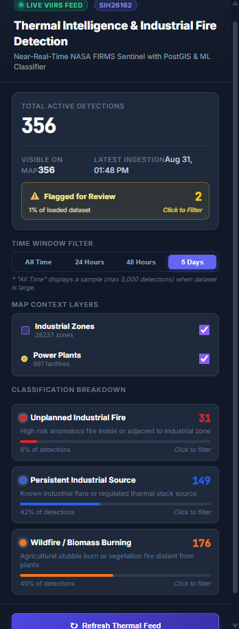
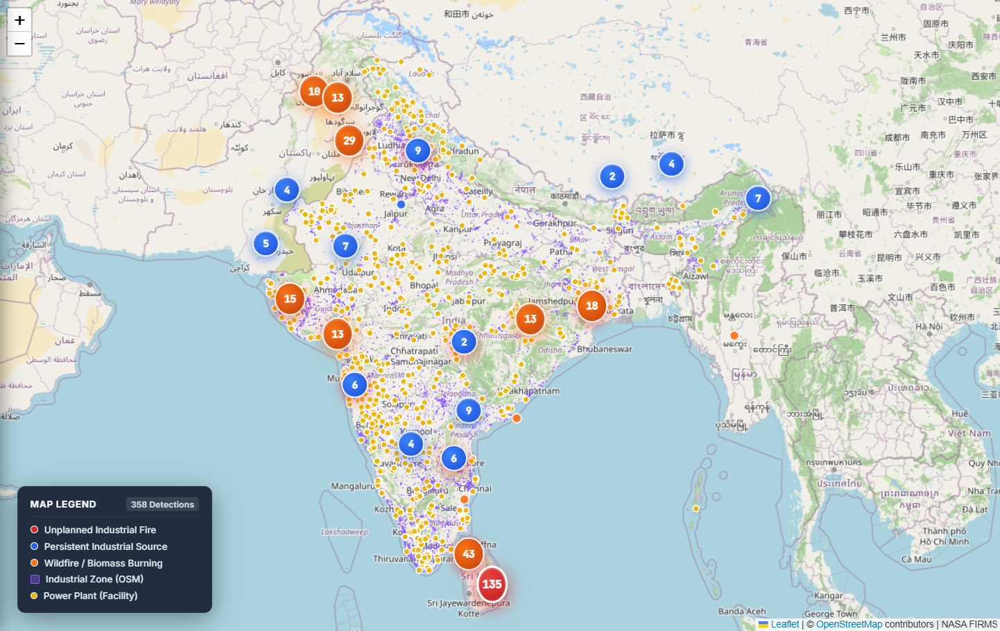

# AI-Based Detection & Classification of Industrial Fires & Flares (SIH 26162)

[](https://sih-26162-ai-based-detection-and-cl.vercel.app/)
[](https://sih26162-ai-based-detection-and.onrender.com/docs)
[](https://render.com)

An end-to-end, near-real-time satellite thermal monitoring and machine learning classification platform for industrial fire safety across India. The system ingests thermal hotspot data from NASA FIRMS (VIIRS_SNPP), enriches each detection with high-performance PostGIS spatial geospatial features (proximity to industrial zones and power plants, plus spatial DBSCAN recurrence), classifies thermal signatures via a Random Forest model into **persistent industrial flares**, **unplanned industrial fires**, or **wildfires/biomass burning**, and visualizes them on an interactive React + Leaflet intelligence dashboard powered by a high-throughput FastAPI backend.

---

## ⚡ How It Works (15-Second Overview)

- **🛰️ Satellite Ingestion**: Continuously ingests Near-Real-Time (NRT) thermal radiation data for India from the NASA FIRMS VIIRS 375m sensor.
- **🗺️ Spatial Feature Engine**: Enriches thermal detections in PostgreSQL/PostGIS by computing KNN distances to 4,000+ industrial zones, 350+ power plants, and spatio-temporal DBSCAN cluster recurrence.
- **🤖 ML Classification**: A Random Forest classifier categorizes detections into *Industrial Flares*, *Unplanned Industrial Fires*, or *Wildfires / Biomass Burning*.
- **🚩 Human-in-the-Loop Triage**: Probabilistic confidence scoring flags ambiguous boundary detections (`confidence < 0.70`) with a `needs_review` indicator for manual safety verification.
- **📊 Interactive Web Dashboard**: Serves GeoJSON layers, live clustering, temporal playback, and risk analytics via FastAPI to a React & Leaflet frontend.

---

## 🔗 Live Demo

- **Interactive Dashboard (Frontend)**: [https://sih-26162-ai-based-detection-and-cl.vercel.app/](https://sih-26162-ai-based-detection-and-cl.vercel.app/)
- **REST API & Swagger Docs (Backend)**: [https://sih26162-ai-based-detection-and.onrender.com/docs](https://sih26162-ai-based-detection-and.onrender.com/docs)

---

## 🏗️ Architecture Overview

```
 +-------------------------------------------------------------------------+
 |                          NASA FIRMS API                                 |
 |               (VIIRS_SNPP 375m NRT Thermal Radiation Data)              |
 +------------------------------------+------------------------------------+
                                      |
                                      v
 +-------------------------------------------------------------------------+
 |                 PostgreSQL + PostGIS Database Engine                    |
 |   - Raw Thermal Hotspots (brightness_temp, FRP, confidence)            |
 |   - Industrial Zone Polygons (OSM Data) & Thermal Power Plants (WRI)    |
 +------------------------------------+------------------------------------+
                                      |
                                      v
 +-------------------------------------------------------------------------+
 |                      Spatial Feature Engineering                        |
 |   - PostGIS KNN ST_Distance (nearest industrial zone & power plant)      |
 |   - Spatio-temporal ST_ClusterDBSCAN recurrence count (eps=0.01)        |
 +------------------------------------+------------------------------------+
                                      |
                                      v
 +-------------------------------------------------------------------------+
 |                     Random Forest ML Classifier                         |
 |   - Predicts: Industrial Flare | Unplanned Industrial Fire | Wildfire   |
 |   - Outputs: Calibrated Confidence Score & `needs_review` Flag (< 0.70) |
 +------------------------------------+------------------------------------+
                                      |
                                      v
 +-------------------------------------------------------------------------+
 |                       FastAPI Backend Service                           |
 |   - High-performance GeoJSON stream endpoints & filtering APIs         |
 |   - Summary statistics, recurrence metrics, and fire risk aggregates    |
 +------------------------------------+------------------------------------+
                                      |
                                      v
 +-------------------------------------------------------------------------+
 |                  React + Leaflet Intelligence Dashboard                 |
 |   - Interactive spatial heatmaps, marker clustering & live filters      |
 |   - Anomaly inspect panel, confidence badges & operational telemetry    |
 +-------------------------------------------------------------------------+
```

---

## 🛠️ Tech Stack Summary

| Layer | Technology | Purpose |
|---|---|---|
| **Data Ingestion** | Python 3, NASA FIRMS REST API | Automated fetching of satellite thermal radiation anomalies |
| **Spatial Database** | PostgreSQL 16, PostGIS 3.4 | Vector spatial indexing (GIST), KNN distance queries, DBSCAN clustering |
| **Feature & ML Pipeline** | scikit-learn, pandas, joblib | Random Forest classification, probability estimation, confidence gating |
| **Backend API** | FastAPI, Uvicorn, psycopg2 | Async REST API, GeoJSON serialization, dynamic bounding box filters |
| **Frontend UI** | React 19, Leaflet, React-Leaflet, MarkerCluster | High-performance interactive map visualization and telemetry analytics |
| **Containerization** | Docker, Docker Compose | Reproducible local spatial database environment with pre-seeded data |
| **Cloud Hosting** | Vercel (Frontend), Render (Backend + Database) | Scalable production hosting and 6-hour recurring sync cron job |

---

## 🚀 Cloud Deployment

The production environment is deployed across modern cloud platforms:

- **Frontend (Vercel)**: Hosted at [sih-26162-ai-based-detection-and-cl.vercel.app](https://sih-26162-ai-based-detection-and-cl.vercel.app/) — continuously built and deployed from the `frontend/` directory on every push to `main`.
- **Backend API (Render)**: Hosted at [sih26162-ai-based-detection-and.onrender.com](https://sih26162-ai-based-detection-and.onrender.com) — FastAPI web service providing automated OpenAPI documentation at `/docs`.
- **Database (Render PostgreSQL + PostGIS)**: Cloud PostgreSQL instance with PostGIS extension enabled, pre-seeded with ~124,000 thermal records and nationwide infrastructure polygons.
- **Automated Data Sync (Render Cron Job)**: Scheduled runner executing `python fetch_firms.py` **every 6 hours** to fetch fresh NASA FIRMS detections and update the live database.

---

## 💻 Quick Start / Local Setup

Follow these steps to run the complete stack locally:

### 1. Clone the Repository
```bash
git clone https://github.com/kumarketanbansal-hue/SIH26162-AI-Based-Detection-and-Classification-of-Industrial-Fires.git
cd SIH26162-AI-Based-Detection-and-Classification-of-Industrial-Fires
```

### 2. Configure Environment Variables
Copy `.env.example` to `.env` and configure your credentials:
```bash
cp .env.example .env
```
In `.env`, provide values for `FIRMS_MAP_KEY` and `DB_PASSWORD`:
```env
FIRMS_MAP_KEY=your_nasa_firms_map_key_here
DB_PASSWORD=your_postgres_password_here
DB_HOST=localhost
BBOX=68.1,6.7,97.4,35.5
```
> [!TIP]
> You can generate a free NASA FIRMS API key at [NASA FIRMS API Key Portal](https://firms.modaps.eosdis.nasa.gov/api/map_key/).

### 3. Start Database Container
Launch the PostGIS database container using Docker Compose:
```bash
docker-compose up -d
```
> [!NOTE]
> `seed_data.sql` automatically pre-loads **~124,000 processed thermal detection points**, 4,000+ industrial zones, and 350+ power plant locations during initial container startup. The dashboard and API work immediately without needing to run the full training pipeline!

### 4. Run the Backend API
Navigate to the backend directory, install dependencies, and start the FastAPI server:
```bash
cd backend
pip install -r requirements.txt
uvicorn main:app --reload --host 0.0.0.0 --port 8000
```
API will be live at `http://localhost:8000` (Swagger docs at `http://localhost:8000/docs`).

### 5. Run the Frontend Dashboard
Navigate to the frontend directory, install dependencies, build the production bundle, and serve it:
```bash
cd frontend
npm install
npm run build
npx serve -s build
```
The dashboard will be accessible at `http://localhost:3000` (or run `npm start` for development mode).

---

## 🧠 Machine Learning & Known Limitations

- **Domain-Rule Bootstrapped Labels**: Because no public ground-truth dataset exists for industrial thermal anomalies across India, training labels were bootstrapped using spatial domain rules (proximity to designated industrial estates/power plants and spatial recurrence).
- **Rule Recovery vs. Novel Prediction**: The Random Forest classifier's near-100% accuracy reflects rule-recovery of the bootstrapping criteria rather than novel, independent prediction.
- **Core ML Contribution**: The genuine machine learning contribution is **probabilistic confidence scoring** and **boundary case triage**:
  - Rather than applying rigid binary cuts, the probabilistic model evaluates ambiguous edge cases across multi-dimensional feature space.
  - Detections with prediction confidence below **0.70** are automatically tagged with the **`needs_review` flag**, routing borderline anomalies to safety operators for human-in-the-loop verification.

---

## 📸 Screenshots & UI Preview

<p align="center">
  
  <br>
  <em>Figure 1: Full-screen intelligence dashboard showing fire classification breakdown, statistics, and live telemetry.</em>
</p>

<p align="center">
  
  <br>
  <em>Figure 2: Interactive geospatial map with clustered thermal hotspots, industrial buffer overlays, and inspection popups.</em>
</p>